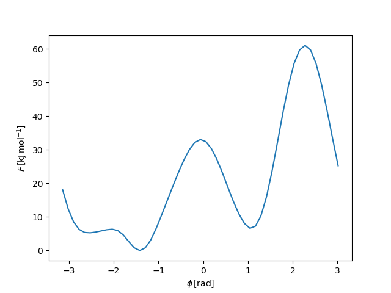

..
    : YAFF is yet another force-field code.
    : Copyright (C) 2011 Toon Verstraelen <Toon.Verstraelen@UGent.be>,
    : Louis Vanduyfhuys <Louis.Vanduyfhuys@UGent.be>, Center for Molecular Modeling
    : (CMM), Ghent University, Ghent, Belgium; all rights reserved unless otherwise
    : stated.
    :
    : This file is part of YAFF.
    :
    : YAFF is free software; you can redistribute it and/or
    : modify it under the terms of the GNU General Public License
    : as published by the Free Software Foundation; either version 3
    : of the License, or (at your option) any later version.
    :
    : YAFF is distributed in the hope that it will be useful,
    : but WITHOUT ANY WARRANTY; without even the implied warranty of
    : MERCHANTABILITY or FITNESS FOR A PARTICULAR PURPOSE.  See the
    : GNU General Public License for more details.
    :
    : You should have received a copy of the GNU General Public License
    : along with this program; if not, see <http://www.gnu.org/licenses/>
    :
    : --

.. _tu_sec_enhanced:

Enhanced sampling methods
#########################

Metadynamics of alanine dipeptide
=================================

The alanine dipeptide molecule has become one of benchmark systems to test
enhanced sampling methods. In this tutorial, we will perform metadynamics
simulations in the gas phase, using the AMBER99 force field. The files are
included in ``yaff/examples/006_enhanced_sampling/mtd_alanine_dipeptide_amber``

The basic idea behind metadynamics, is that during a simulation the potential
energy will be biased by artificially adding repulsive terms in regions of the
phase space that are often visited. This way, the simulation will be steered to
explore unfavorable regions of phase space, which allows reconstructing the
entire free energy surface afterwards with relative little sampling (compared
to regular MD, where unfavorable regions are never visited).

PLUMED
------

We can use Yaff together with PLUMED to perform metadynamics. For alanine
dipeptide, the phase space can be represented by two dihedral angles, also
called collective variables. The repulsive terms that are added will be
Gaussian functions of these dihedral angles with a certain width and a fixed
height. This information needs to be provided in the ``plumed.dat`` input
file::

    # set up two variables for Phi and Psi dihedral angles
    phi: TORSION ATOMS=5,7,9,15
    psi: TORSION ATOMS=7,9,15,17
    #
    # Activate metadynamics in phi and psi
    # depositing a Gaussian every 500 time steps,
    # with height equal to 1.2 kJoule/mol,
    # and width 0.35 rad for both CVs.
    #
    metad: METAD ARG=phi,psi PACE=500 HEIGHT=1.2 SIGMA=0.35,0.35 FILE=HILLS
    # monitor the two variables and the metadynamics bias potential
    PRINT STRIDE=10 ARG=phi,psi,metad.bias FILE=COLVAR

We first prepare the force field and some hooks, just as we would when
performing regular MD in the canonical ensemble::

    T = 300*kelvin
    ff = get_alaninedipeptide_amber99ff()
    vsl = VerletScreenLog(step=1000)
    fh5 = h5.File('traj.h5','w')
    h5writer = HDF5Writer(fh5, step=1000)
    thermo = NHCThermostat(T, timecon=100*femtosecond)
    hooks = [thermo, vsl, h5writer]

Now we couple PLUMED with Yaff by constructing a
:class:`yaff.external.libplumed.ForcePartPlumed` instance::

    plumed = ForcePartPlumed(ff.system, fn='plumed.dat')
    ff.add_part(plumed)
    hooks.append(plumed)

The PLUMED ForcePart has to be added to the ForceField, in order take the bias
potential into account when computing energies. Additionally, it has to be
passed to the integrator as a Hook, so PLUMED knows when the integrator
performs a time step. Once this is done, the remainder of the script is the
same as for a regular MD simulation::

    verlet = VerletIntegrator(ff, 0.5*femtosecond, temp0=2*T, hooks=hooks)
    verlet.run(1000000)

All metadynamics output will be written by PLUMED, and it is therefore
advisable to use PLUMED for postprocessing these files.

Yaff
----

It is also possible to perform metadynamics using only Yaff. The initial and
final part of the MD script stays the same. Instead of using PLUMED, we will
now need the :class:`yaff.sampling.enhanced.MTDHook` class::

    # Define the collective variables, two dihedral angles
    cv0 = CVInternalCoordinate(ff.system, DihedAngle(4,6,8,14))
    cv1 = CVInternalCoordinate(ff.system, DihedAngle(6,8,14,16))
    # The widths of the Gaussians, in rad
    sigmas = np.array([0.35,0.35])
    # Dihedral angles are periodic, this has to be taken into account!
    periodicities = np.array([2.0*np.pi,2.0*np.pi])
    # Initialize the MTD hook
    mtd = MTDHook(ff, [cv0,cv1], sigmas, 1.2*kjmol, periodicities=periodicities,
        f=fh5, start=500, step=500)
    hooks.append(mtd)

This will (should) give the same settings as the ones in the PLUMED file. Data
specific to MTD will be stored in the ``hills`` group of the fh5 file. After
the simulation, the free energy surface can be reconstructed making use of the
:class:`yaff.analysis.biased_sampling.SumHills` class, as demonstrated in the
file ``yaff/examples/006_enhanced_sampling/mtd_alanine_dipeptide_amber/process.py``::

    npoints = 51
    # Construct a regular 2D grid, spanning from -pi to +pi in both dimensions
    grid0 = np.linspace(-np.pi,np.pi,npoints,endpoint=False)
    grid1 = np.linspace(-np.pi,np.pi,npoints,endpoint=False)
    grid = np.zeros((grid0.shape[0]*grid1.shape[0],2))
    grid[:,0] = np.repeat(grid0, grid1.shape[0])
    grid[:,1] = np.tile(grid1, grid0.shape[0])
    mtd = SumHills(grid)
    mtd.load_hdf5('traj.h5')
    fes = mtd.compute_fes()
    # Reshape to rectangular grids
    grid = grid.reshape((grid0.shape[0],grid1.shape[0],2))
    fes = fes.reshape((grid0.shape[0],grid1.shape[0]))

As there are two collective variables, the free energy surface is two-
dimensional. By integrating over one of the two dihedral angles, we can obtain
the free energy as a function of only one dihedral angle::

    # Free energy as a function of DihedAngle(4,6,8,14), by integrating over
    # other collective variable
    beta = 1.0/boltzmann/T
    fes_phi = -1./beta*np.log(np.sum(np.exp(-beta*fes), axis=1))
    fes_phi -= np.amin(fes_phi)
    plt.clf()
    plt.plot(grid[:,0,0], fes_phi/kjmol)
    plt.xlabel("$\phi\,[\mathrm{rad}]$")
    plt.ylabel("$F\,[\mathrm{kJ}\,\mathrm{mol}^{-1}]$")
    plt.savefig('fes_phi.png')

This should result in a plot similar to the one below.

