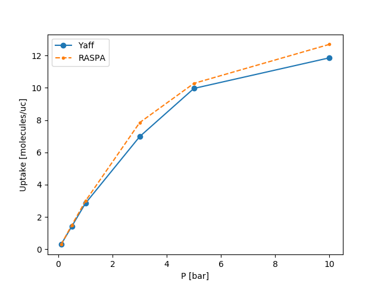

..
    : YAFF is yet another force-field code.
    : Copyright (C) 2011 Toon Verstraelen <Toon.Verstraelen@UGent.be>,
    : Louis Vanduyfhuys <Louis.Vanduyfhuys@UGent.be>, Center for Molecular Modeling
    : (CMM), Ghent University, Ghent, Belgium; all rights reserved unless otherwise
    : stated.
    :
    : This file is part of YAFF.
    :
    : YAFF is free software; you can redistribute it and/or
    : modify it under the terms of the GNU General Public License
    : as published by the Free Software Foundation; either version 3
    : of the License, or (at your option) any later version.
    :
    : YAFF is distributed in the hope that it will be useful,
    : but WITHOUT ANY WARRANTY; without even the implied warranty of
    : MERCHANTABILITY or FITNESS FOR A PARTICULAR PURPOSE.  See the
    : GNU General Public License for more details.
    :
    : You should have received a copy of the GNU General Public License
    : along with this program; if not, see <http://www.gnu.org/licenses/>
    :
    : --

.. _tu_sec_montecarlo:

Monte Carlo simulations
#######################

GCMC simulation of CO2 adsorption in MIL-53
===========================================

Simulating an adsorption isotherm using Yaff
--------------------------------------------

Here we take a look at the adsorption of rigid CO2 molecules (the guests)
inside a MIL-53 framework (the host), the example provided in
``yaff/examples/007_monte_carlo/co2_in_mil53/``
The following input files are required to construct an isotherm for such a
case:

    * CO2.chk: a checkpoint file describing a single guest molecule
    * MIL53.chk: a checkpoint file describing the host
    * pars.txt: a parameter file describing host-guest and guest-guest
      interactions. Note that it may also contain host-host interactions, but these
      are irrelevant for this type of simulation. Also covalent terms may be present,
      but again this is irrelevant for these rigid simulations.

The first part of the GCMC script, sets up a :class:`yaff.sampling.mc.GCMC`
instance. The setup has been automated and is performed as follows::

    # Setup the GCMC simulation
    fn_guest = 'CO2.chk'
    fn_host = 'MIL53.chk'
    fn_pars = ['pars.txt']
    host = System.from_file(fn_host).supercell(1,1,1)
    screenlog = MCScreenLog(step=10000)
    log.set_level(log.silent)
    gcmc = GCMC.from_files(fn_guest, fn_pars, host=host,
        rcut=12.0*angstrom, tr=None, tailcorrections=True, hooks=[screenlog],
        reci_ei='ewald_interaction', nguests=30)

Notice that the ``from_files`` class method accepts all keywords that can be
passed to :class:`yaff.pes.generator.FFArgs` constructor. In this case, we set
``rcut``, ``tr``, ``reci_ei`` and ``tailcorrections``. The ``nguests`` keyword
can be a guess of the maximum number of adsorbed guests during the simulation.
It is only used for the initialization of some data structures, and has no
influence on the simulation itself.
Next, we define the allowed MC moves and their relative probabilities::

    # Description of allowed MC moves and their corresponding probabilities
    mc_moves =  {'insertion':1.0, 'deletion':1.0,
                 'translation':1.0, 'rotation':1.0}

If the guest molecule is a single atom, the ``rotation`` move should have
probability 0. The relative probabilities can influence the rate of convergence
, but shoud not impact the final results.

Technically, the chemical potential of the external gas reservoir is controlled
in the grand-canonical ensemble. It is however intuitively more appealing to
think about controlling the pressure of the reservoir, and this has to be
specified before running a GCMC simulation in Yaff. However, the conversion
from a pressure to the chemical potential is not straightforward if the gas
reservoir is far from ideal behavior. In this case, the pressure should first
be converted to a fugacity, which can be done using the :mod:`yaff.pes.eos`.
Here, the Peng-Robinson equation of state is used::

    # Construct equation of state to link pressure, fugacity and chemical potential
    eos = PREOS.from_name('carbondioxide')

The number of adsorbed guests can then be simulated at a certain temperature
and pressure as follows::

    fugacity = eos.calculate_fugacity(T,P)
    mu = eos.calculate_mu(T,P)
    print("fugacity = %8.5f bar mu = %12.6f kjmol" % (fugacity/bar, mu/kjmol))
    # Set the external conditions
    gcmc.set_external_conditions(T, fugacity)
    # Run MC simulation
    gcmc.run(1000000, mc_moves=mc_moves)

Because we attached a MCScreenLog at the start, some output will be printed
during the simulation. This output might be interrupted once in a while: this
happens when an additional ForceField needs to be constructed. As we are
simulating with a variable number of atoms, it is necessary to generate new
ForceFields during a simulation as the number of adsorbed guests increases.
To avoid this, the ``nguests`` keyword should be put higher.

Note that the number of required steps to reach convergence will depend on the
external conditions. The phase increases as the number of particles increases.
Generally, the number of GCMC steps should be increased with increasing pressure
and decreasing temperature.

By running the ``gcmc.py`` script, the uptake will be computed for a number
of pressures sequentially and store the results in `results.npy`. 

Simulating an adsorption isotherm using RASPA
---------------------------------------------

RASPA is a software package mainly aimed at Monte Carlo simulations. Yaff has
some support for reading/writing RASPA output/input files by means of the
:mod:`yaff.conversion.raspa` module. The script
``yaff/examples/007_monte_carlo/co2_in_mil53/raspa.py`` generates RASPA input
files for the current system and will place these in the directory
``yaff/examples/007_monte_carlo/co2_in_mil53/raspa``. By adjusting some
settings in the generated ``simulation.template``, an isotherm can be simulated
with RASPA. Note that in this case, RASPA requires the usage of a 
:math:`2\times2\times2` supercell. For more detailed guidelines on how to
proceed with these simulations, consult the RASPA manual. Afterwards, the RASPA
output files (``*.data`` files) should be placed in
``yaff/examples/007_monte_carlo/co2_in_mil53/raspa/Output/System_0`` in order
to process the results.

Comparing Yaff and RASPA results
--------------------------------

After the ``gcmc.py`` script generated Yaff data and the RASPA output files are
placed in the correct directory, both isotherms can be compared. This is done
by running the ``process.py`` script which produces a plot that should look
like this:

The remaining differences (especially visible at higher loading) are likely due
to insufficient sampling: GCMC simulations require many MC steps for
convergence, especially at higher densities. There may also be some small
deviations in the PES used in both programs, for instance different accuracy
settings for the electrostatics. Finally there could be a bug in the Yaff MC
routines, but let's hope that this is not the case!
