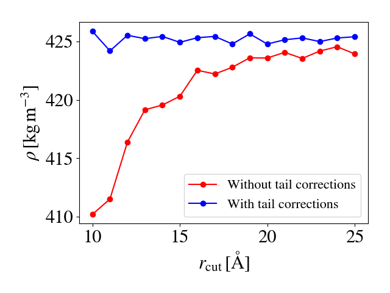
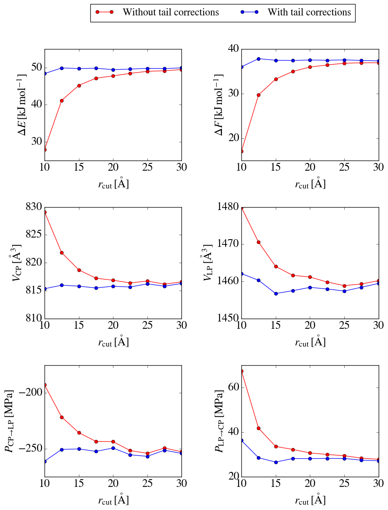

..
    : YAFF is yet another force-field code.
    : Copyright (C) 2011 Toon Verstraelen <Toon.Verstraelen@UGent.be>,
    : Louis Vanduyfhuys <Louis.Vanduyfhuys@UGent.be>, Center for Molecular Modeling
    : (CMM), Ghent University, Ghent, Belgium; all rights reserved unless otherwise
    : stated.
    :
    : This file is part of YAFF.
    :
    : YAFF is free software; you can redistribute it and/or
    : modify it under the terms of the GNU General Public License
    : as published by the Free Software Foundation; either version 3
    : of the License, or (at your option) any later version.
    :
    : YAFF is distributed in the hope that it will be useful,
    : but WITHOUT ANY WARRANTY; without even the implied warranty of
    : MERCHANTABILITY or FITNESS FOR A PARTICULAR PURPOSE.  See the
    : GNU General Public License for more details.
    :
    : You should have received a copy of the GNU General Public License
    : along with this program; if not, see <http://www.gnu.org/licenses/>
    :
    : --

.. _tu_sec_tailcorrections:

Tail corrections for non-covalent interactions
#######################################################

Introduction
============

Theory
------

When performing force-field calculations on periodic systems, it is
in principle necessary to consider infinitely many periodic images when
computing non-covalent interactions. In practice, this is of course not
feasible. One method to deal with this, is to split the total interaction into
a real-space and reciprocal-space part, where the latter can be accurately
approximated using for instance a Fourier transform. A second method is to only
consider interactions up to a certain cutoff radius and estimate the neglected
interactions by assuming the system is uniform beyond this cutoff radius. This
second method, referred to as tail corrections, will be presented here. Note
that for non-covalent interactions decaying slower than :math:`r^{-3}` (for
instance monopole electrostatic interactions), tail corrections are not
applicable and the first method has to be used, for instance using the Ewald
summation.

Only pair-wise additive non-covalent interactions, for example the Lennard-
Jones potential, are considered so it suffices to consider the interaction
between two particles in a unit cell that is periodically repeated. Suppose the
*true* interaction for these particles at distance :math:`r` is given by
:math:`U(r)`. In force-field simulations, the potential :math:`U(r)T(r)` is
used where :math:`T(r)` is a truncation function. An example is neglecting
any interaction for particles separated by a distance larger than
:math:`r_\text{cut}`:

.. math:: T(r) = \left\lbrace \begin{array}{ll}
                     1 & \text{if } r < r_\text{cut} \\
                     0 & \text{if } r >= r_\text{cut}
                 \end{array} \right.

This simple truncation function is however not continuous. This leads to
forces that are in principle infinite in :math:`r_\text{cut}`, which can lead
to poor total energy conservation in MD simulations. The preferred truncation
function in YAFF is therefore the Switch3 function :class:`yaff.pes.ext.Switch3`,
which is continuously differentiable.

The basic assumption for the tail corrections implemented in YAFF is that the
system is homogeneous (the radial distribution function is unity for all pairs
of atoms) in regions where the truncation function is active (different from 1).
In this case, the tail energy is given by

.. math:: E_{\text{tail}} &= \frac{ \int d\mathbf{r} U(r)[1-T(r)] } { \int d\mathbf{r} } \\
                          &= \frac{4\pi}{V} \int_{0}^{\infty} U(r)[1-T(r)]r^2 dr
    :label: eq_etail

There are no corrections to the forces, as it is assumed that the system is
homogeneous and thus isotropic in regions where the truncation function is
active. There is however a contribution to the virial tensor

.. math:: W_{\alpha\beta,\text{tail}} &= \frac{ \int d\mathbf{r} F_{\alpha}r_{\beta}[1-T(r)] } { \int d\mathbf{r} } \\
        &= \frac{4\pi\delta_{\alpha\beta}}{3V} \int_{0}^{\infty} \frac{ \{dU(r)[1-T(r)]\}}{dr}r^3 dr
    :label: eq_wtail

For systems which are not homogeneous at long range (such as interfacial
systems), it is not a good idea to use the tail corrections proposed here.

Usage
-----

Tail corrections are implemented for each pair potential (:class:`yaff.pes.ext.PairPot`)
in YAFF. In order to add tail corrections to a force field (:class:`yaff.pes.ff.ForceField`),
one should construct a :class:`yaff.pes.ff.ForcePartTailCorrection` part using the
pair potential in question and add this part to the force field. When
constructing the YAFF force field using :meth:`~yaff.pes.ff.ForceField.generate`, it
suffices to provide the keyword argument ``tailcorrections=True`` which is by
default set to ``False``.

Implementation
--------------

The analytical evaluation of Eqs. :eq:`eq_etail` and :eq:`eq_wtail` for the
various :math:`U(r)` implemented in YAFF is performed using Maple. The
resulting formulas are then automatically converted to C code. The script used
for this automated code generation can be found in ``tools/code_generation/tailcorr``
Given the Maple expressions for all :math:`U(r)` present in YAFF, this script
writes the files ``tailcorr.c`` and ``tailcorr.h`` which have to be included
in the ``yaff/pes`` package.

Liquid density of methane with TraPPE
=====================================

As an example, the influence of tail corrections on liquid methane are
investigated. This system is expected to be appproximately homogeneous,
so the tail corrections implemented here should give decent results. The TraPPE
[Martin1998]_ model for methane is used, which is a united-atom model. Methane
molecules are represented as single sites interacting through a Lennard-Jones
potential.

Convergence of energy and pressure
----------------------------------

The file ``yaff/examples/004_tailcorrections/methane_trappe/sp.py`` computes
the energy and pressure for a *randomized* system of liquid methane as a
function of the cutoff distance. This script runs in a few seconds. Clearly,
the energy and pressure including tail corrections converge much faster to the
correct value (which is obtained as the cutoff distance is very large). Because
:math:`U(r)` is generally negative and rising for large values of :math:`r`,
the correction to the energy is generally negative while the correction to the
pressure is generally positive, as can be seen from Eqs. :eq:`eq_etail` and
:eq:`eq_wtail`.

Convergence of the liquid density
---------------------------------

The file ``yaff/examples/004_tailcorrections/methane_trappe/md.py`` computes
the density of methane at :math:`T=110\,\text{K}` and :math:`P=1\,\text{atm}`.
The resulting convergence as a function of the cutoff distance is shown below.

By including more long-range interactions, which are generally attractive,
smaller volumes are favoured and thus higher liquid densities are found.

Free energy profile of MIL-53(Al) using thermodynamic integration
=================================================================

A similar investigation is performed for MIL-53(Al). Using thermodynamic
integration, the free energy as a function of the volume is obtained. [Rogge2015]_
It is interesting to note that the tail corrections only depend on the volume
and the number of particles. Because the correction to the virial tensor is
always isotropic, the equations of motion are not modified in ensembles where
the volume and number of particles are constant. This is the case for the
:math:`(N,V,\mathbf{\sigma}_a=0,T)` ensemble which is used in these simulations.
This means that the tail corrections can in this case be applied *a posteriori*.

The results are summarized below, where for example
:math:`\Delta F=F_{\text{LP}}-F_{\text{NP}}`. Again it is clear that including
more long-range interactions favours smaller volumes. Even when
:math:`r_{\text{cut}}=15\,\mathrm{\AA}`, the free energy barrier is
underestimated by several kJ/mol when neglecting tail corrections. On the other
hand, including tail corrections and using :math:`r_{\text{cut}}=12.5\,\mathrm{\AA}`
provides results much closer to the converged values, at a reduced
computational cost.

References
==========

.. [Martin1998] Martin, M.G. and Siepmann,  J.I. 'Transferable potentials
   for phase equilibria. 1. United-atom description of n-alkanes'.
   *J. Phys. Chem. B* **102**, 2569-2577 (1998). URL
   http://dx.doi.org/10.1021/jp972543%2B
.. [Rogge2015] Rogge, S.M.J. and Vanduyfhuys, L. and Ghysels, A. and
   Waroquier, M. and Verstraelen, T. and Maurin, G. and Van Speybroeck, V.
   'A Comparison of Barostats for the Mechanical Characterization of
   Metal-Organic Frameworks'.
   *J. Chem. Theory Comput.* **11 (12)**, 5583–5597 (2015). URL
   http://dx.doi.org/10.1021/acs.jctc.5b00748
