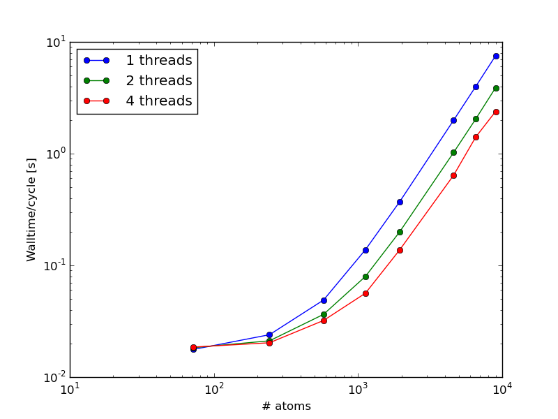

.. _ug_sec_parallel:

Parallelization
##################

Introduction
============

Yaff has a limited support to perform computations in parallel. The
shared-memory OpenMP paradigm is adopted, which limits the parallelization to
single nodes. This also implies that only parts of the code written in low-level
C are subject to parallelization. The parallelization is local, in the sense
that separate algorithms are parallelized independently. This makes it easier
to prevent parallelization errors, but might hinder further computational time
savings. This is in line with the Yaff mission statement.

To enable OpenMP support, the Cython modules need to be compiled with the
``-fopenmp`` flag. If this flag is not used in the ``setup.py`` script, all
OpenMP pragmas in the code are simply ignored. At runtime, the number of
threads can by set for example using the ``OMP_NUM_THREADS`` environment
variable::

    export OMP_NUM_THREADS=4

By default, the number of threads equals the number of processors.

It is advised to always test which number of threads offers is suitable for
the application at hand in order to avoid wasting precious CPU time.

.. _ug_sec_para_ewald:

Ewald summation in reciprocal space
===================================

The Ewald summation in reciprocal space contains a loop over all atoms within
the loop over all reciprocal cell vectors. The former loop is distributed over
different threads with minimal overhead.

The directory ``data/examples/004_parallelization`` contains the script
``ewald.py`` which can be used to test the scaling of the reciprocal Ewald
part for alpha quartz. The following results are obtained using a quadcore
Intel i7 processor:

This shows that a good parallelization is obtained for systems with more than
1000 atoms. **TODO.** We should run scaling tests on HPC.
