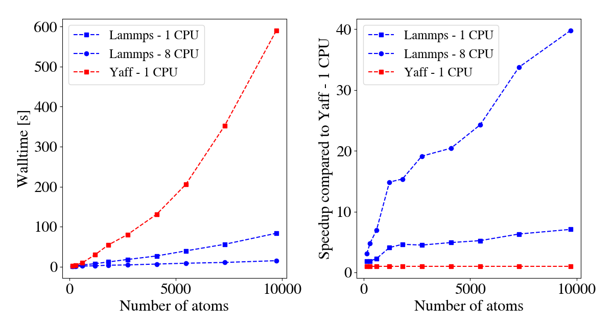
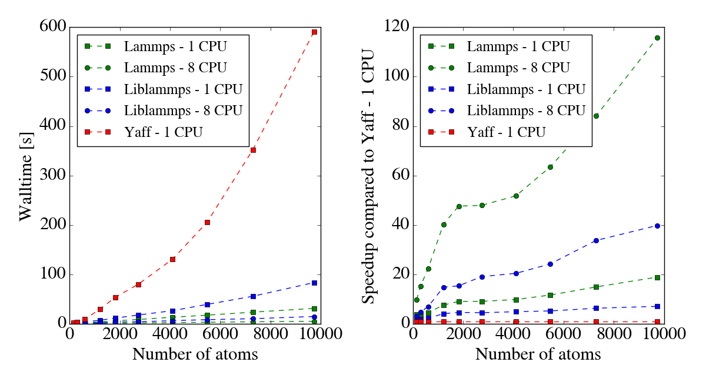

..
    : YAFF is yet another force-field code.
    : Copyright (C) 2011 Toon Verstraelen <Toon.Verstraelen@UGent.be>,
    : Louis Vanduyfhuys <Louis.Vanduyfhuys@UGent.be>, Center for Molecular Modeling
    : (CMM), Ghent University, Ghent, Belgium; all rights reserved unless otherwise
    : stated.
    :
    : This file is part of YAFF.
    :
    : YAFF is free software; you can redistribute it and/or
    : modify it under the terms of the GNU General Public License
    : as published by the Free Software Foundation; either version 3
    : of the License, or (at your option) any later version.
    :
    : YAFF is distributed in the hope that it will be useful,
    : but WITHOUT ANY WARRANTY; without even the implied warranty of
    : MERCHANTABILITY or FITNESS FOR A PARTICULAR PURPOSE.  See the
    : GNU General Public License for more details.
    :
    : You should have received a copy of the GNU General Public License
    : along with this program; if not, see <http://www.gnu.org/licenses/>
    :
    : --

Speeding up Yaff
################

Introduction
============

Yaff is intended to provide a properly tested reference implementation for
classical force-field simulations. Because of its strictly modular
implementation in Python, it is an excellent tool to develop and test new
models. The main drawback is that Yaff is computationally not very efficient
compared to other codes, especially when simulating large systems (i.e. more
than a few hundred of atoms).

The bottleneck in nearly all MD simulations is the evaluation of noncovalent
interactions. This section discusses a method that allow to speed up this
part of the simulation, using LAMMPS as a library. Alternatively, it is
discussed how a Yaff force field can be converted to LAMMPS input files,
bypassing Yaff completely.

Using LAMMPS as a library to evaluate noncovalent interactions
==============================================================

Quick start
-----------

It is possible to use LAMMPS as a library: Yaff provides LAMMPS with atomic
coordinates and cell vectors, LAMMPS returns the energy, atomic forces and
the virial tensor. This means that all other aspects of the simulation (such as
the sampling) are still done by Yaff. Because the noncovalent interactions are
provided to LAMMPS in tables, there are (in principle) no restrictions on the
force field that is used (as long as it is pairwise-additive).

In order to use this feature, you will need to install the Python interface to
the LAMMPS library. The easiest way for linux and osx users is to do this
using Conda::

    conda install -c conda-forge lammps

For users of the HPC at Ghent University, it suffices to load a recent LAMMPS
module. If you want to compile the LAMMPS library yourself, you can take a look
in the `LAMMPS documentation <https://lammps.sandia.gov/doc/Python_shlib.html>`_

The usage is (hopefully) very simple: once you have constructed a conventional
ForceField instance, you call the
:func:`yaff.external.liblammps.swap_noncovalent_lammps` function, which
returns a new ForceField instance where noncovalent forces will be evaluated
using LAMMPS::

    from yaff.external.liblammps import swap_noncovalent_lammps
    ff_lammps = swap_noncovalent_lammps(ff_yaff, fn_system='system.dat', fn_table='table.dat')

It is normal that energies provided by ``ff_lammps`` deviate from ``ff_yaff``
by about 1kJ/mol, or even more for very large systems. Without electrostatics,
the difference should be much smaller. If the difference in energy is much
larger, or the construction of ``ff_lammps`` fails, you are in trouble and you
should resort to the Troubleshooting section below.

The :func:`yaff.external.liblammps.swap_noncovalent_lammps` function accepts
many optional arguments. Most default values should be fine. The ``fn_system``
and ``fn_table`` have to be files that are unique for each combination of a
System and a ForceField (``fn_table`` does not have to be updated when simply
a larger supercell is used). Because generating the tabulated interactions can
take a lot of time, the default behavior is to not overwrite ``fn_table``,
unless ``overwrite_table=True`` is provided. More optional arguments are
described in the in-depth section below.

Results
-------

The speedup that can be obtained is system specific. Generally, the largest
speedups are obtained for systems with many atoms. The plot below shows the
walltime for 100 steps of a NVT simulation of MIL-53 using a force field where
the covalent part is derived using QuickFF, Gaussian charge-distribution
electrostatics, and a Buckingham potential. For a cell containing 152 atoms,
the simulation with LAMMPS as a library is a factor 1.8 faster than Yaff. When
LAMMPS runs parallel over 8 cores, a speedup of 3 compared to Yaff is observed.
If a 4x4x4 supercell (containing 9728 atoms) is considered, the LAMMPS library
enables a speedup of a factor 7, increasing to a factor 40 when 8 cores are
used.

The directory ``data/examples/005_speed/mil53_quickff`` contains the files
necessary to generate the plot above.

Parallelisation
---------------

If the LAMMPS library is compiled with MPI enabled, it is possible to run the
LAMMPS calculation in parallel. This can be done for instance using a command
that looks as follows::

    mpirun -np 8 md.py

It is important to note that the code in ``md.py`` will be run independently
by 8 processes at the same time. Only during the force evaluation using LAMMPS,
the processes will work together. An important consequence is that you **must**
ensure that every process runs the same simulation. For most MD simulations,
this means ensuring that every process starts with the same initial
configuration (positions, velocities, thermostat/barostat variables,...). The
easiest way is to set the seed of the random number generator (but don't forget
to use different seeds if you want to do multiple independent simulations).

In order to use MPI, your main python script should initialize an mpi4py
communicator. If your MPI enabled LAMMPS library is called ``liblammps_mpi.so``
, you should specify the suffix when setting up the LAMMPS ForcePart. The
following lines of code illustrate a typical parallelised simulation::

    import numpy as np
    np.random.seed(42) # Ensure each process starts from the same configuration

    from mpi4py import MPI
    comm = MPI.COMM_WORLD
    rank = comm.Get_rank()

    from yaff import log
    from yaff.pes import ForceField
    from yaff.external import swap_noncovalent_lammps
    from yaff.sampling import VerletScreenLog

    # You probably want output (logging, VerletScreenLog, HDF5Writer, ...) to
    # be generated by only one process. Every process has an MPI rank, this
    # allows controlling which processes write output.
    if rank==0:
        log.set_level(log.high)
    else:
        log.set_level(log.silent)

    ff = ForceField.generate(...)
    ff_lammps = swap_noncovalent_lammps(ff, comm=comm, suffix='mpi')

    # Remainder of the simulation stays the same...

The directory ``data/examples/005_speed/mil53_quickff`` illustrates how the
LAMMPS library can be used in parallel.

In-depth guide
--------------

The interface between Yaff and LAMMPS is intended to be a black box. Using the
:func:`yaff.external.liblammps.swap_noncovalent_lammps` function, users can
automatically handle noncovalent interactions using LAMMPS as a library. This
section is only intended for people who need to understand what is happening
under the hood.

**The LAMMPS library and Python interface**

The Python interface to LAMMPS is part of LAMMPS itself, and therefore not
discussed here. Documentation is available in the
`LAMMPS manual <https://lammps.sandia.gov/doc/Python_shlib.html>`_
The manual also explains how to compile LAMMPS as a library. It is mandatory
to compile with the kspace and molecule packages. A possible series of commands
to compile might look like this::

    cd src
    make yes-kspace
    make yes-molecule
    make yes-python # Installs the Python bindings
    make mode=shlib serial # Serial version
    make mode=shlib intel_cpu_intelmpi # Intel compiler toolchain with MPI

This should produce a liblammps*.so or liblammps*.dylib file. Make sure your
system knows where this resides by putting its directory in ``$LD_LIBRARY_PATH``
or ``$DYLD_LIBRARY_PATH`` for osx users.

**Tabulated potentials**

The concept of the tabulated potentials will be explained starting from a
standard expression used in pairwise-additive force fields: atoms i and j
interact with a Lennard-Jones potential and point-charge electrostatics:

:math:`E_{ij} = f_{ij}^{vdW} 4\epsilon_{ij}\left[ \left(\frac{\sigma_{ij}}{r_{ij}}\right)^{12}
- \left(\frac{\sigma_{ij}}{r_{ij}}\right)^{6} \right] + f_{ij}^{ei}\frac{q_iq_j}{r_{ij}}`

:math:`f_{ij}^{vdW}` and :math:`f_{ij}^{ei}` are called fudge factors and are
used to scale the interaction between neighboring atoms. The electrostatic
contribution for a periodic system is only conditionally convergent and
requires a special treatment such as the Ewald or Wolf summation. When LAMMPS
is used as a library from Yaff, the noncovalent interactions is therefore
split into two contributions: point-charge electrostatics and everything else.
In order to make the coupling of LAMMPS and Yaff as general as possible,
everything but the point-charge electrostatics (in this case the Lennard-Jones
potential) is tabulated.

A more complicated situation arises when Gaussian charge distributions are used
. The expression for the interaction energy is now given by

:math:`E_{ij} = f_{ij}^{vdW} 4\epsilon_{ij}\left[ \left(\frac{\sigma_{ij}}{r_{ij}}\right)^{12}
- \left(\frac{\sigma_{ij}}{r_{ij}}\right)^{6} \right] + f_{ij}^{ei}\frac{q_iq_j erf(r_{ij}/\gamma_{ij})}{r_{ij}}`

This can however be rewritten as

:math:`E_{ij} = f_{ij}^{vdW} 4\epsilon_{ij}\left[ \left(\frac{\sigma_{ij}}{r_{ij}}\right)^{12}
- \left(\frac{\sigma_{ij}}{r_{ij}}\right)^{6} \right] - f_{ij}^{ei}\frac{q_iq_jerfc(r_{ij}/\gamma_{ij}}{r_{ij}} + f_{ij}^{ei}\frac{q_iq_j}{r_{ij}}`

As said before, everything but point-charge electrostatics will be tabulated.
In this case, the table will thus contain a van der Waals contributions as well
as a correction equal to the difference of Gaussian and point-charge
electrostatics. Things get even more complicated when different fudge factors
:math:`f_{ij}^{vdW}` and :math:`f_{ij}^{ei}` are used. In some in-house force
fields, it is indeed the case that always :math:`f_{ij}^{ei}=1` while
:math:`f_{ij}^{vdW}=0` for 1-2 and 1-3 neighbors. Because the table mixes
van der Waals and electrostatic contributions, this cannot be implemented
directly. A workaround is to use :math:`f_{ij}^{vdW}` for the table and then
calculate the missing electrostatic interactions for 1-2 and 1-3 neighbors in
Yaff, making using of the :class:`yaff.pes.nlist.BondedNeighborList` class.
This entire procedure is automated in the
:func:`yaff.external.liblammps.swap_noncovalent_lammps` function, but might
require modifications for advanced users.

**Controlling the behavior of LAMMPS**

The :func:`yaff.external.liblammps.ForcePartLammps` class and the
:func:`yaff.external.liblammps.swap_noncovalent_lammps` function have some
keywords that might be of interest for advanced users. Using ``nrows``, the
radial spacing of the tabulated potential is controlled. The default value of
5000 rows should provide sufficient accuracy. Increasing the number of rows
might give slightly more accurate energies but is a bit slower. The ``kspace``
keyword controls how electrostatics are treated and should be either ``ewald``
or ``pppm``. The PPPM solver has a more favorable scaling and is preferred over
the traditional Ewald method, except perhaps for very small systems. Using the
``kspace_accuracy`` keyword, the error on electrostatic energies and forces can
be controlled. Again, higher accuracy (meaning smaller ``kspace_accuracy``)
will increase the computational cost. Finally, by setting ``move_central_cell``
to true, all atoms will be placed in the central cell before passing atomic
positions to LAMMPS. This should in general not be necessary.

Troubleshooting
---------------

A few pointers on what to do when things go wrong:

* If you are unable to initialize a :func:`yaff.external.liblammps.ForcePartLammps`
  object: check that the ``lammps.py`` file (distributed with LAMMPS) is in your
  ``PYTHONPATH`` and that the ``liblammps*`` file is in a directory where your
  operating system looks for libraries (using for instance ``$LD_LIBRARY_PATH``
  on unix).
* If your Python script seems to terminate unexpectedly without an error
  message, this usually means something went wrong in the low-level LAMMPS code
  . Set the ``fn_log`` keyword for the
  :func:`yaff.external.liblammps.swap_noncovalent_lammps` function to
  ``lammps.log``. Run the simulation again and inspect the ``lammps.log`` file.
  Using the LAMMPS manual or user forum you should be able to trace the origin
  of the error. Note that the default behavior is to not write a LAMMPS log
  file, as it can become rather large and does not contain useful information
  for a correctly running simulation.
* If you manage to construct a ForcePartLammps but you notice large deviations
  from the corresponding Yaff energies, you should start by inspecting the
  generated ``fn_system`` and ``fn_table``. It can also help to read the
  previous section, which discusses some details of how LAMMPS and Yaff are
  coupled. Finally, you can ask Steven for help (if he is still around),
  otherwise you are in for a debugging session yourself...

Converting a Yaff force field to LAMMPS
=======================================

In a case where outsourcing the calculation of noncovalent interactions to
LAMMPS is not enough, you can consider ditching Yaff entirely and performing
your simulations with LAMMPS. This means you will lose all nice features of
Yaff, but it has to be mentioned that LAMMPS features a myriad of implemented
methods, has a large and active userbase, and is potentially a lot faster
than running simulations with Yaff.
Do note that NOT all Yaff force fields can be converted to LAMMPS. A typical
force field generated using QuickFF (anno 2019) should work. Please always
check that Yaff and LAMMPS energies agree up to a fraction of a kcalmol.

The procedure will be illustrated making use of the example provided in
``data/examples/005_speed/mil53_quickff``. We start by creating a System
instance and a directory where LAMMPS input files will be stored::

    # Generate supercell system
    supercell = (2,2,2)
    system = System.from_file('system.chk').supercell(nx,ny,nz)
    dn = 'lammps_%s'%('.'.join("%d"%n for n in [nx,ny,nz]))
    if not os.path.isdir(dn): os.makedirs(dn)

Optionally, we can tabulate the van der Waals interactions. For a Buckingham
expression combined with Gaussian electrostatics, this offers a good speedup.
For Lennard-Jones combined with point electrostatics, the gains are probably
marginal. Note that the table is independent of the supercell size::

    # Tabulate vdW interactions
    rcut = 15.0*angstrom
    if not os.path.isfile('lammps.table'):
        ff = ForceField.generate(system, ['pars.txt'], rcut=rcut)
        write_lammps_table(ff, fn='lammps.table', rmin=0.50*angstrom,
            nrows=2500, unit_style='real')

We chose the unit\_style ``real``, this decides the units used by LAMMPS.
The actual conversion to LAMMPS is done by the function
:func:`yaff.external.lammpsio.ff2lammps`. More options are available in the
reference guide, but its basic usage is well illustrated by this example::

    # Write the LAMMPS input files
    ff2lammps(system, 'pars.txt', dn, rcut=15.0*angstrom, tailcorrections=False,
        tabulated=True, unit_style='real')

This will generate at least a ``lammps.in`` and a ``lammps.table`` file in
``dn``. Unless you know what you are doing, you should not edit manually edit
the ``lammps.data`` file. The ``lammps.in`` file probably has to be edited, as
it controls what happens in the simulation. More information on this subject is
available in the LAMMPS manual.

We conclude by comparing the timings of pure LAMMPS simulations with Yaff, with
and without using LAMMPS as a library.

If a 4x4x4 supercell (containing 9728 atoms) is considered, LAMMPS offers
a speedup of a factor 19, increasing to a factor 116 when 8 cores are
used.
